# EventLog Tracer

Windows-Anwendung zur **lokalen Analyse und Überwachung von Windows-Ereignisprotokollen**. Der Event Log Tracer (ELT) macht die Ereignisanzeige übersichtlicher, findet Auffälligkeiten automatisch und löst bei bestimmten Ereignissen Alerts aus.

> Entwickelt während meines Praktikums. Die Screenshots zeigen Beispieldaten.

## Was das Tool macht

- **Ereignisse durchsuchen und filtern:** nach Kanal, Level, Text, Event-IDs (auch Ausschluss), Quelle und Zeitraum. Der Folgen-Modus zeigt neue Ereignisse live.
- **Details auf einen Blick:** Detailansicht, XML und ein Wissensbereich zum ausgewählten Ereignis.
- **Volltextsuche** mit speicherbaren Suchen.
- **Statistik:** Ereignisse über Zeit, Verteilung nach Level, häufigste Event-IDs und Quellen.
- **Auffälligkeiten:** Erkennt zum Beispiel seltene Event-IDs, erhöhte Fehlerraten im Vergleich zur Baseline und Security-Signale wie einen neu installierten Dienst. Bürotage und Bürozeiten sind konfigurierbar.
- **Alerts:** Regeln mit Bedingung und Aktion (Übersicht, Webhook) samt Verlauf.
- **Lesezeichen** mit Farbe und Kommentar, zum Beispiel für Ticket-Verweise.
- **Export und Bericht**, mehrere Tabs, Split View, helles und dunkles Design sowie Tastenkürzel.

## Screenshots

### Hauptfenster (hell und dunkel)

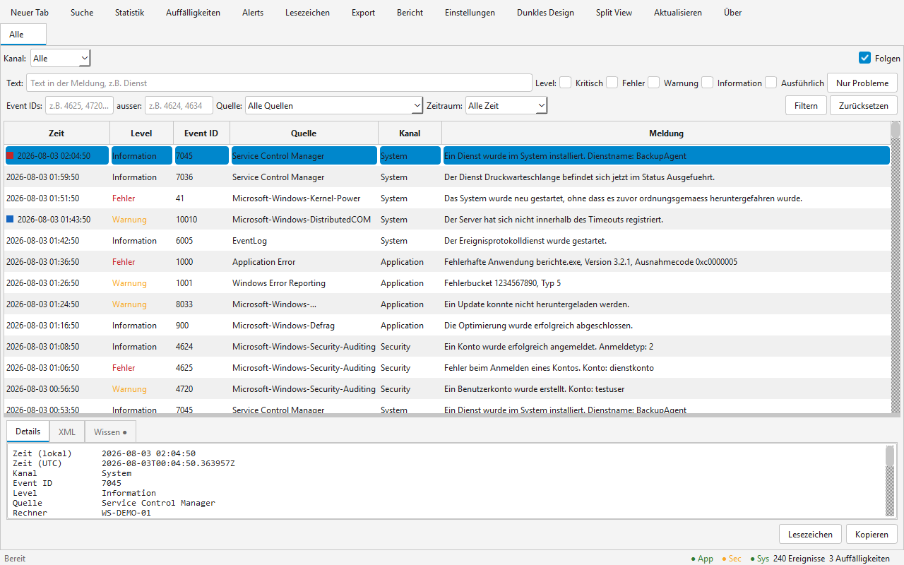

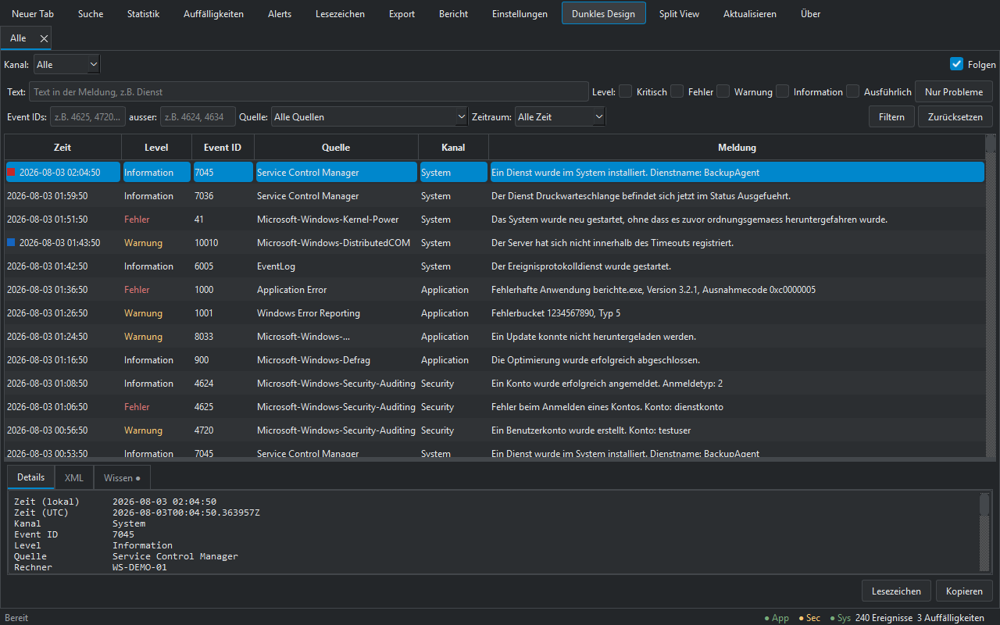

### Statistik

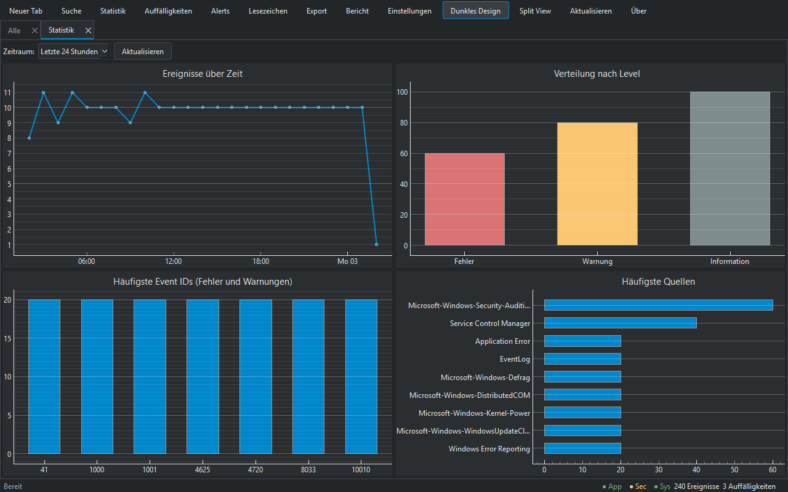

### Suche

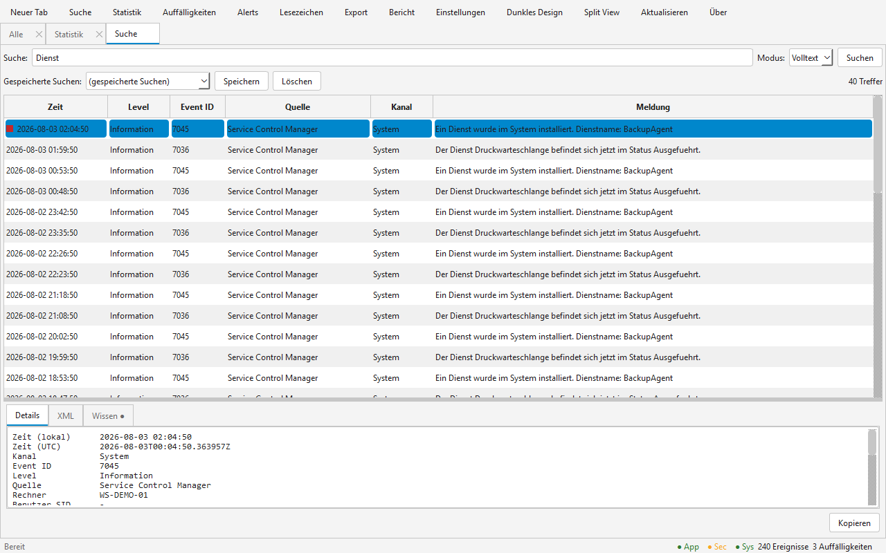

### Auffälligkeiten

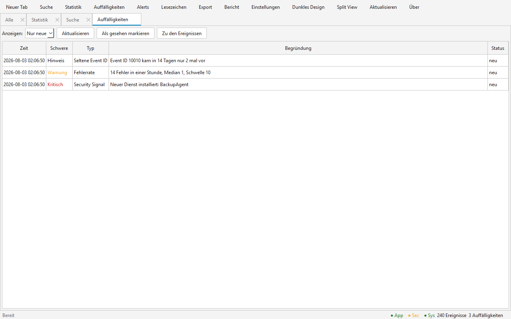

### Alerts

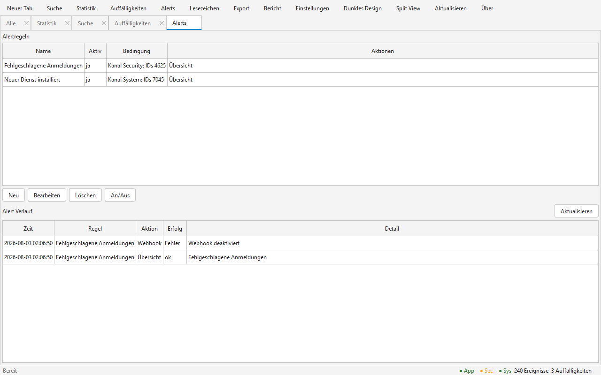

### Lesezeichen

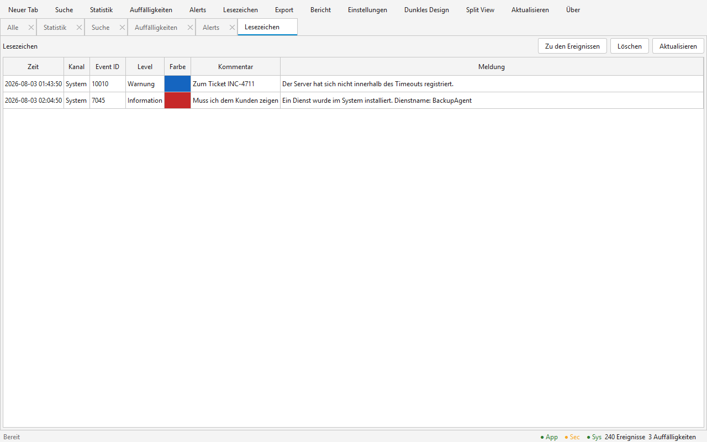

### Einstellungen

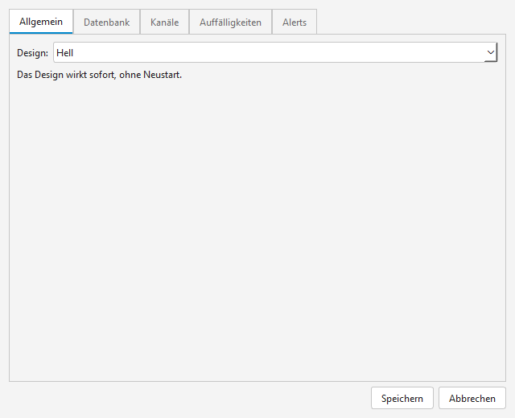
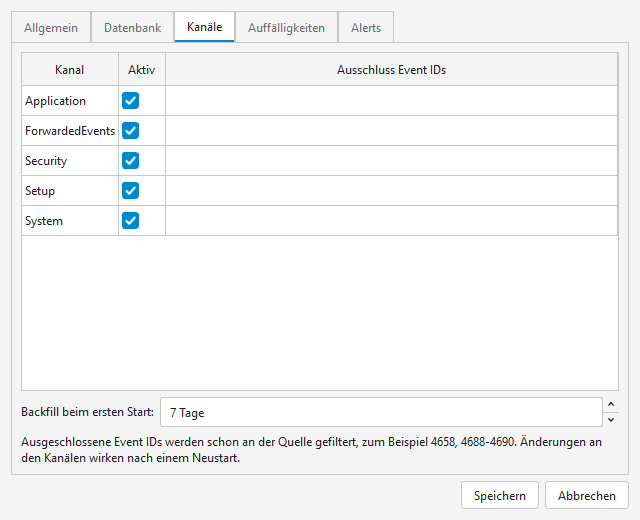
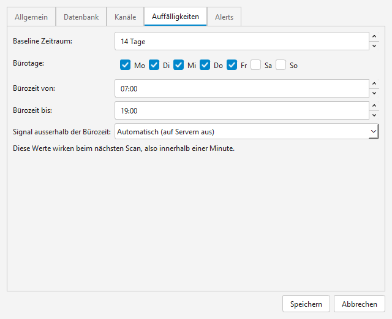

### Tastenkürzel

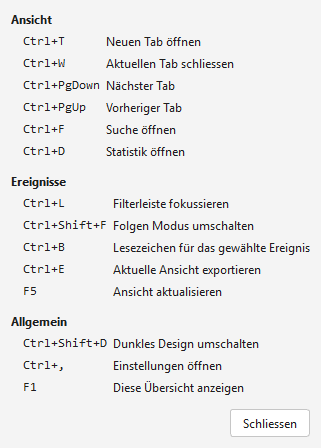
